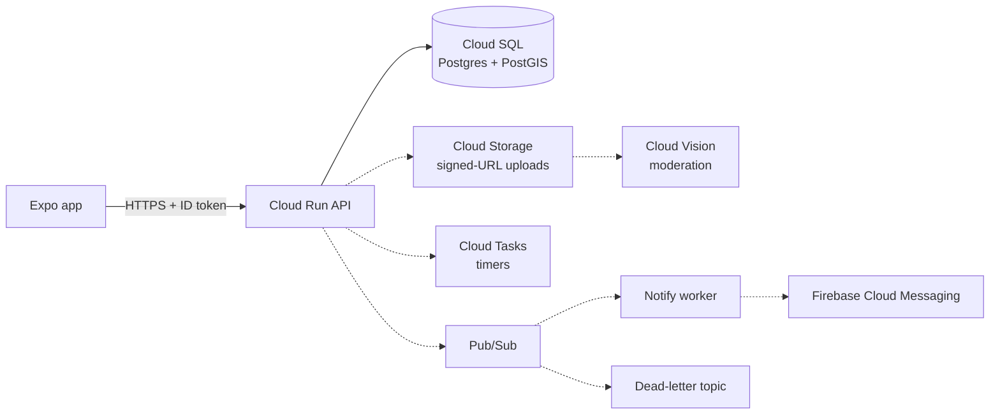

## Habib Adnan

**Computer Science student, final semester** · New York

I'm working toward a career in cloud solutions architecture. Right now that means building Pullup, a serverless app on Google Cloud, end to end: choosing the managed services, writing the infrastructure as code, wiring up CI/CD, and documenting the trade-offs behind each decision.

**Currently studying for:** Google Cloud Professional Cloud Architect · AWS Certified Solutions Architect – Associate

---

### Pullup: serverless, event-driven app on Google Cloud *(in progress)*

My main cloud project: a mobile app for spontaneous real-life hangouts. The whole Google Cloud environment is provisioned with Terraform, with least-privilege IAM and keyless GitHub Actions deploys through Workload Identity Federation.

**Working today:** the Expo app, a Fastify API on Cloud Run, and Cloud SQL with PostGIS for "nearby" search. **Next:** the event-driven pieces shown dashed below.

<b>Design decisions</b>

 

| Decision | Why |
|---|---|
| Cloud Run over GKE or Compute Engine | Spiky traffic, near zero overnight. Scale-to-zero keeps cost near $0 with no cluster to run. |
| Cloud SQL + PostGIS over Firestore | "Hangouts within 5 km that haven't ended" is a geo query. PostGIS handles it with a GiST index. |
| Pub/Sub between API and notifications *(planned)* | The API stays fast when push delivery is slow. Retries and a dead-letter topic absorb failures. |
| Cloud Tasks for expiry and reminders *(planned)* | One task per hangout, fired at the exact time, instead of a cron job scanning the table. |
| Private bucket + signed URLs *(planned)* | Uploads go straight to storage, never through the API, and nothing is publicly listable. |
| One service account per workload | Least privilege: the API can't send pushes, the worker can't read photos. |
| `max_instance_count = 5` | Caps spend and keeps Cloud SQL connections under the tier's limit. |
| Monitoring and billing budget in Terraform | Uptime checks, alerts, and a budget ship with the infrastructure, not after it. |

### CloudPulse: network monitoring platform *(in design)*

Planned architecture: a Python agent reporting latency, packet loss, and DNS health to a Cloud Run API backed by Firestore, with a Next.js dashboard. Later phases add Pub/Sub workers, Terraform, CI/CD, reliability testing, and a cost analysis.

---

### Stack

| Area | Tools and practices |
|---|---|
| **Google Cloud** | Cloud Run · Cloud SQL · Cloud Storage · Pub/Sub · Cloud Tasks · Secret Manager · Artifact Registry · IAM · Workload Identity Federation · Cloud Monitoring · Identity Platform · Firebase |
| **Infrastructure** | Terraform · Docker · GitHub Actions |
| **Practices** | Infrastructure as code · CI/CD · least-privilege IAM · event-driven design · cost controls · observability |
| **Languages** | Python · TypeScript · Java |

### Other projects

- **[CodePilot](https://github.com/Habadnan/CodePilot)**: AI codebase onboarding with summaries, dependency graphs, and RAG-powered Q&A. Containerized with Docker.
- **[Nimbus](https://github.com/Habadnan/nimbus-lang)**: a programming language from scratch, with a lexer, parser, bytecode compiler, stack VM, and built-in HTTP servers.
