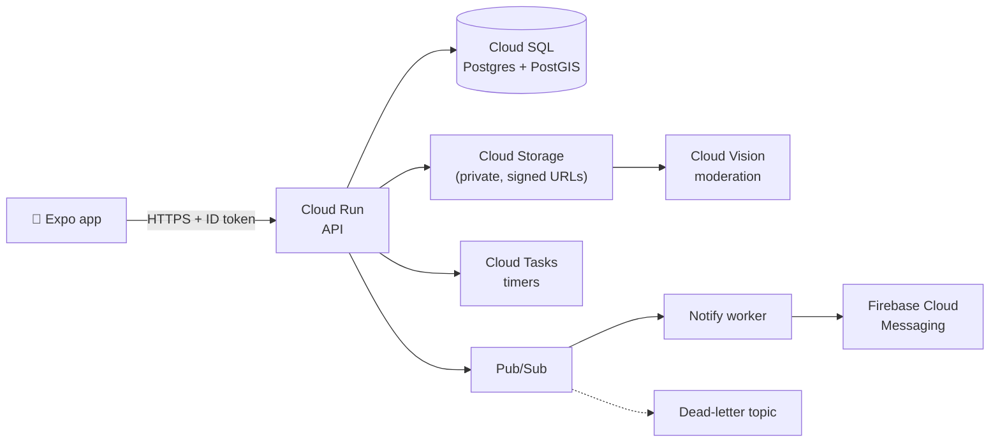

  

  

  📍 New York &nbsp;·&nbsp; ☁️ Focused on cloud solutions architecture

I design and build cloud systems end to end: picking the right managed services, writing the infrastructure as code, wiring up CI/CD, and documenting the trade-offs behind each decision.

---

### 🏗️ Featured architecture: Pullup

A mobile app for spontaneous real-life hangouts, running on a **serverless, event-driven Google Cloud backend** that's fully provisioned with **Terraform** and deployed through **GitHub Actions with Workload Identity Federation** (no service account keys).

<b>Key design decisions</b> (click to expand)

| Decision | Why |
|---|---|
| **Cloud Run** over GKE / Compute Engine | Spiky traffic, near zero overnight. Scale-to-zero keeps cost near $0 with no cluster to run. |
| **Cloud SQL + PostGIS** over Firestore | "Hangouts within 5 km that haven't ended" is a geo query. PostGIS handles it with a GiST index. |
| **Pub/Sub** between API and notifications | The API stays fast when push delivery is slow; retries and a dead-letter topic absorb failures. |
| **Cloud Tasks** for expiry and reminders | One task per hangout, fired at the exact time, instead of a cron job scanning the table. |
| **Private bucket + signed URLs** | Uploads go straight to storage, never through the API, and nothing is publicly listable. |
| **One service account per workload** | Least privilege: the API can't send pushes, the worker can't read photos. |
| **`max_instance_count = 5`** | Caps spend and keeps Cloud SQL connections under the tier's limit. |
| **Monitoring + billing budget** | Uptime checks, alerts, and a budget are part of the Terraform, not an afterthought. |

### 🚧 In progress: CloudPulse

A cloud-native network and infrastructure monitoring platform: a Python agent reporting latency, packet loss, and DNS health to a **Cloud Run** API backed by **Firestore**, with a Next.js dashboard. The roadmap adds Pub/Sub workers, Terraform, CI/CD, reliability testing, and a cost analysis.

---

### 🧰 Cloud & platform

  

**Google Cloud:** Cloud Run · Cloud SQL · Cloud Storage · Pub/Sub · Cloud Tasks · Secret Manager · Artifact Registry · IAM & Workload Identity Federation · Cloud Monitoring · Identity Platform · Firebase

**Practices:** Infrastructure as code · CI/CD · least-privilege IAM · event-driven design · cost controls · observability

**Languages:** Python · TypeScript · Java

  

### 🛠️ Other projects

| Project | What it is |
|---|---|
| 🧭 **[CodePilot](https://github.com/Habadnan/CodePilot)** | AI codebase onboarding with summaries, dependency graphs, and RAG-powered Q&A. Containerized with Docker. |
| 🌩️ **[Nimbus](https://github.com/Habadnan/nimbus-lang)** | A programming language from scratch: lexer, parser, bytecode compiler, stack VM, and built-in HTTP servers |
| 🐏 **[RateMyRams](https://github.com/Habadnan/RateMyRams)** | Professor reviews and course insights for Farmingdale State students |

---

  

  

